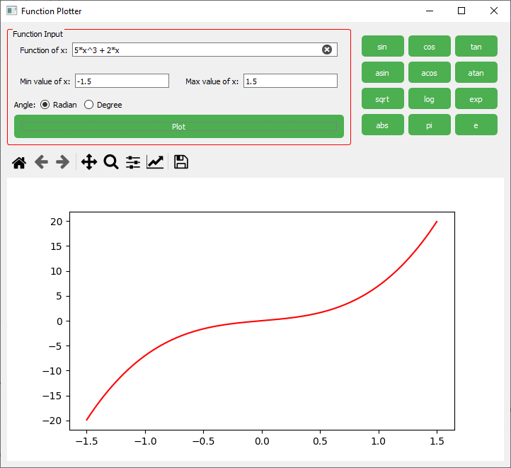
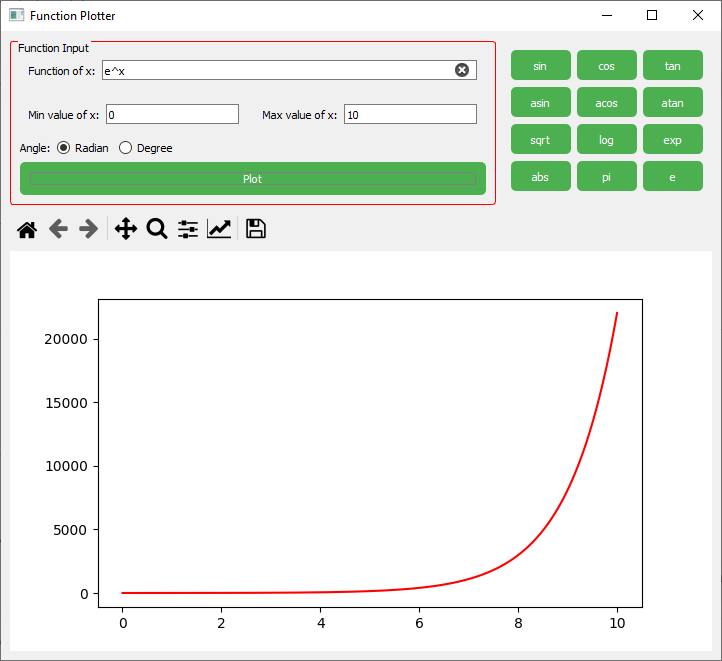
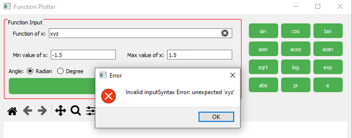

# Function Plotter

The Function Plotter is a graphical application that allows users to input a mathematical function and plot its graph.
It provides a user-friendly interface for specifying the function, minimum and maximum values of the x-axis, and various
options for plotting.

## Requirements

- Python 3.10
- PySide2
- Matplotlib

## Installation

1. Install the required dependencies:

```
pip install PySide2 matplotlib
```

2. Run the program:

```
python app.py
```

## Code Structure

The code is organized into several modules and classes to handle different aspects of the application. Here's an
overview of the main components:

- `app.py`: This is the main entry point of the application. It creates an instance of the `MainWindow` class, which
  serves as the main window of the application.

- `MainWindow`: This class represents the main window of the application. It contains a form for inputting the function
  and options for plotting, as well as a canvas for displaying the graph.

- `Form`: This class represents the input form for the function and plot options. It includes fields for entering the
  function, minimum and maximum values of the x-axis, and options for selecting the angle and plot type.

- `MplCanvas`: This class extends the Matplotlib `FigureCanvas` to provide a canvas for displaying the graph. It
  includes methods for plotting the function and updating the canvas.

- `SideBar`: This class represents a sidebar widget that contains buttons for inserting predefined function names into
  the function input field.

- `Utils`: This module provides utility functions for parsing and evaluating mathematical functions, as well as
  validating input values.

## Usage

1. Launch the application by running `python app.py`.

2. Enter the mathematical function you want to plot in the "Function of x" field. The function can include basic
   arithmetic operations (+, -, *, /), parentheses, and predefined function names (e.g., sin, cos, sqrt). You can also
   use the `^` symbol for exponentiation.

3. Specify the minimum and maximum values of the x-axis in the respective fields.

4. Choose the angle type (radian or degree) for trigonometric functions.

5. Click the "Plot" button to generate the graph.

6. The graph will be displayed in the canvas area below the input form. You can use the toolbar at the top of the graph
   to interact with the plot (zoom, pan, save, etc.).

7. If there are any errors in the input (e.g., invalid function syntax), an error message will be displayed.

8. You can use the predefined function buttons in the sidebar to insert function names into the function input field.

## Examples

#### Here are some examples of valid functions that can be plotted using the application:


.png)
#### Examples of invalid functions:



## Conclusion

The Function Plotter is a simple yet useful application for visualizing mathematical functions. It provides an intuitive
interface for specifying the function and plot options and displays the resulting graph in real-time. With further
enhancements and additions, it can serve as a powerful tool for exploring and analyzing mathematical functions.